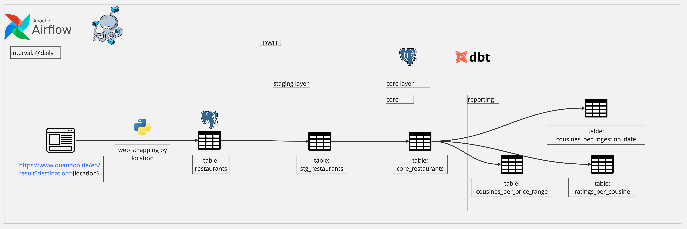
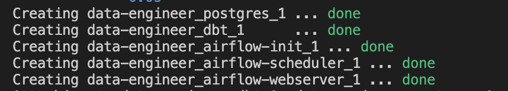
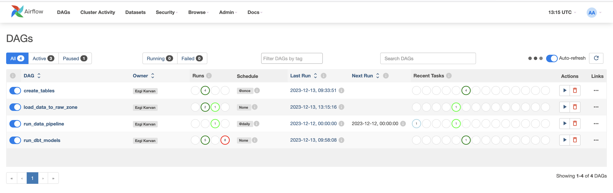
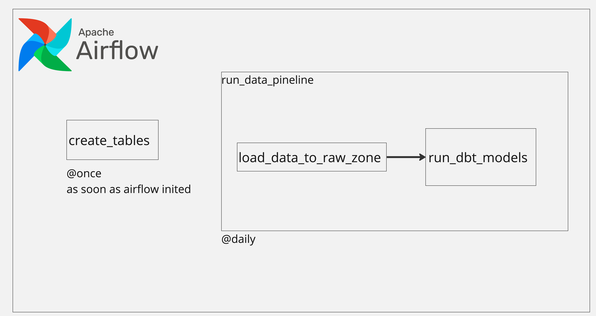

# Data Engineer Task Solution

## Architecture Diagram

To be able to solve the data engineer task, I used following technologies.


1. Python to scrap restaurants data from https://www.quandoo.de/en/result?destination={location}
2. Postgres for the database.
3. dbt to transform the restaurants data.
4. Airflow to run the pipeline in daily bases.
5. Docker compose to build dockerized pipeline.


App is scrapping restaurants data for spesific location which is setted 'berlin' for demonstration purposes in the script. After scrapping, it is writing data to `restaurants` table. Each time airflow run the pipeline the table trucate and data is inserted.

With dbt;
 - `stg_restaurants` is a replica of `restaurants` table.
 - `core_restaurants` table is feeding with `stg_restaurants` table. Load type can be changed to incremental after the first load. There is data transformation in between, such as assigning NULL to rating field if rating is '' in staging table.
 - `ratings_per_cousine`, `cousines_per_price_range`, `cousines_per_ingestion_date` has been created for reporting purposes from `core_restaurants` table.





## Get started


1. Copy .env.example file as .env in the project directory.

2. After making sure docker deamon is up and running, run following commands in the project directory.

 ```bash
 docker build . --tag extending_airflow:latest
 ```

 ```bash
 docker-compose up --build
```

 These steps will create postgres, dbt, airflow scheduler and webserver.

 

3. We need to add postgres connection for airflow with following steps. Please check if web server's image name needs replacement with the one that have created.

 ```bash
docker exec -it data-engineer_airflow-webserver_1 bash
```

 ```bash
 airflow connections add 'postgres_default' \
    --conn-json '{
        "conn_type": "postgres",
        "login": "postgres",
        "password": "docker",
        "host": "database",
        "port": 5432
    }'
 ```

4. We are all set up. You can open up airflow UI  `http://localhost:8080/`

Credentials are;
- user: airflow
- pass: airflow

You will see the dags are listed in the UI.

- create_tables DAG will be run as soon as UI is started.
- run_data_pipeline DAG will be run in daily bases which containes 2 different DAG triggers in it as showed [here](#dags-diagram). Feel free to run the DAG to not wait for the scheduled time.

 


 - You can run following commands to check the data in staging, core and reporting layers.

 ```bash
docker-compose exec postgres psql -U airflow -c "SELECT * FROM restaurants;” airflow
```

 ```bash
docker-compose exec postgres psql -U airflow -c "SELECT * FROM stg_restaurants;” airflow
```

 ```bash
docker-compose exec postgres psql -U airflow -c "SELECT * FROM core_restaurants;” airflow
```

 ```bash
docker-compose exec postgres psql -U airflow -c "SELECT * FROM ratings_per_cousine;” airflow
```

 ```bash
docker-compose exec postgres psql -U airflow -c "SELECT * FROM cousines_per_price_range;” airflow
```

 ```bash
docker-compose exec postgres psql -U airflow -c "SELECT * FROM cousines_per_ingestion_date;” airflow
```

## Dags Diagram


