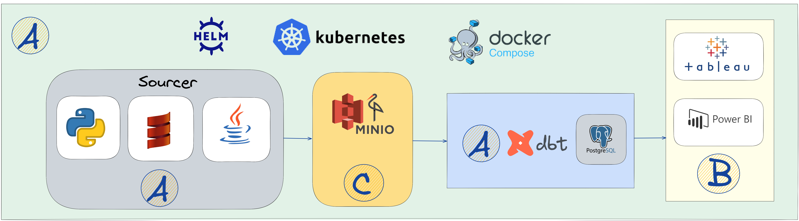

# Data Engineering test assignment

Hello and thank you for applying for the Data Engineer position at Quandoo!
We hope the assignment will be interesting for you and will help us get to know each other better.

In a nutshell, a small system to collect and process restaurant data should be built.

The completion of the whole task could be challenging. Hence, it's split into two parts mandatory(A) and the optional parts(B & C).

## The Motivation:
In general the motive of this task is to:
* Demonstrate problem solving skills
* Demonstrate ability to not only build pipelines but also to think and set up the deployment and CI/CD processes
* Catch a glimpse of what working at Quandoo would look like
* Get a closer look at the coding and documenting skills of the candidate

### Points to consider:
1. A frame of the system can be found below. It includes the mandatory parts and also the extra parts
2. If the full solution that you have in mind is too complex or time-consuming to implement, provide an architectural diagram and describe your idea in detail
3. We highly appreciate a document containing the details of what was done and why
4. **Suggested points are not mandatory**. Feel free to use any technology/source you consider to be the best

## The Mandatory Part(A)
### The sourcer
* Build an app to scrape/fetch data from a website which contains restaurants data and publishes the data to the DB
* The data can be retrieved using An API or by setting up a scraping process or by using a combination of both
* The app should be configurable to fetch restaurant's data of any location. Ex: Berlin(or certain zone of Berlin)

**Suggestions**:
* To scrape data using geo_id. This URL -> https://www.tripadvisor.com/RestaurantSearch?Action=PAGE&geo=187323&sortOrder=relevance&o=a{page_number} can be used for retrieving pages

Any other open data sources could be used to fetch data

**Extra improvements suggestions**:
* To have a schedule for the sourcer to run(daily/hourly/monthly)
* Think how to fetch only new restaurant data on each run

### The Database
* Deploy a database. The database is expected to be supported by [DBT](https://docs.getdbt.com/docs/supported-data-platforms)
* Build the initial database layer to store the sourcer data
* Build Datamarts layer to store calculated data
* Add more layers if it's needed

**Suggestions for the Datamarts**:
* Calculated data of how much cousin types(German, Italian, ..) are ingested per a price range($, $$-$$$, .. in Tripadvisor)
* Calculated data of review ratings in the DWH per cuisine type (Indian, Italian, …)
* Count of different cuisines ingested per ingestion date. It means if there is data for several days then the Datamart should contain counts against each date
* Counts of different price ranges ingested per ingestion date. It means if there is data for several days then the Datamart should contain counts against each date
* Any other possible insights can be generated and stored as a Datamart

### The DWH
* [Use DBT](https://getdbt.com) to process data from the raw to the Datamarts layers
* Consider how to update Datamarts on a certain schedule(hourly, daily)

### The deployment
* Dockerize all the pipelines

**Suggestions**:
* Use Docker Compose to run all the containers
* To deploy a K8s cluster locally and use Helm charts releases

## The Optional Part(B & C)

* ### Visualising the Data(B)
  Choose your preferred tool (Tableau, PowerBI, any other tool) for visualising the data and provide insights of the Datamart layer. The dashboards implementation is up to the candidate

* ### Add Data Lake layer(C)
  Add a raw data storage to store scraped data and add another pipeline to deliver the raw data to the DB(S3 Minio or any other tool)

* ### Any extra components
  Feel free to suggest any extra components you probably have experience with(adding a queue, monitoring, more DBs)
  In this case please provide a diagram alongside with the description to justify your choices

### The described part of the test task can be seen on this diagram :

## Things to consider before submitting
* Please provide a detailed document describing how to run the test assignment
* The deployment of all the components should be easy to use. Like pushing a few buttons. Feel free to use Bash if it's needed
* The solution is expected to be runnable on Mac and Linux
* Please consider the database to be the DWH. The data can be denormalized
* It would be great to think about scaling the system and describe it in the document

## Submitting your solutions

* Fork it to a [!]private[!] gitlab repository (go to Settings -> General -> Visibility, project features, permissions -> Project visibility).
* Commit & Push your solutions (including all the diagrams, descriptions and code)
* Share the project with the gitlab users: @martin.marx @sachin.nair2 @tamizhselvan.kandasamy @elmehdi.elkhayati (go to Settings -> Members -> Invite member, find the user in Select members to invite and set Choose a role permission to Developer)

* Send us an ssh clone link to the repository.

We are looking forward to discussing your solutions with you. Good luck!